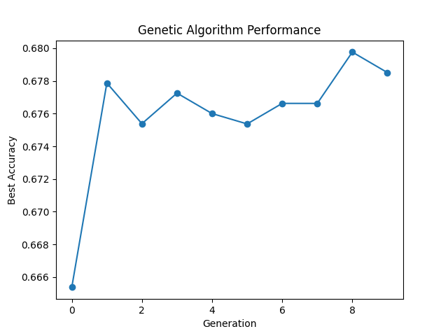
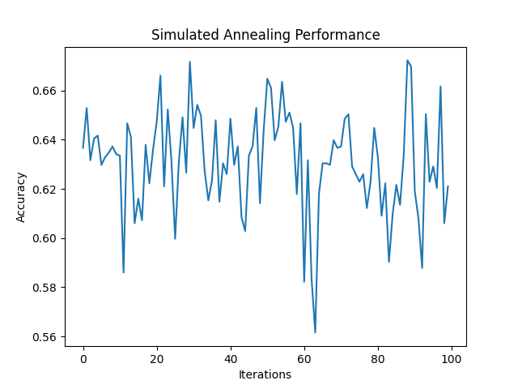
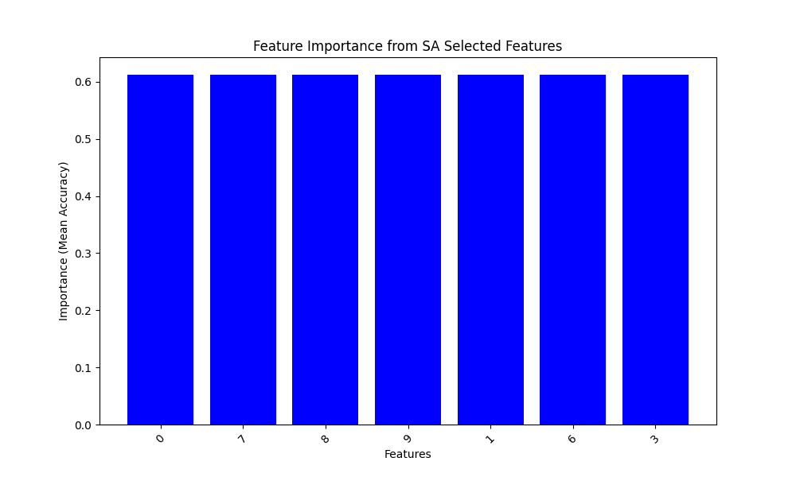
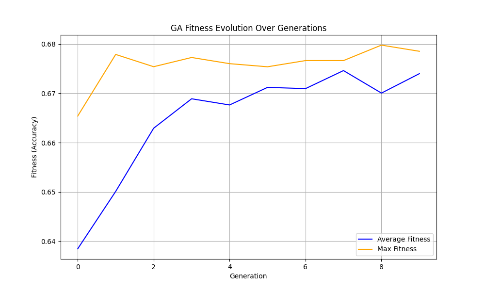
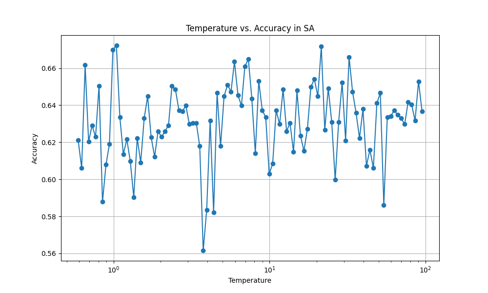
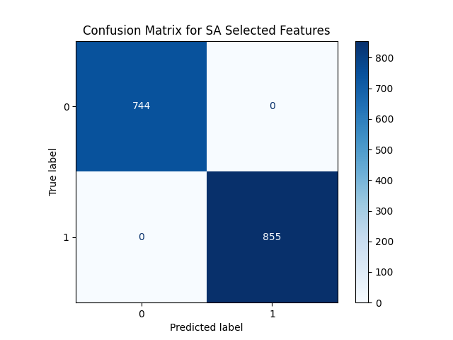
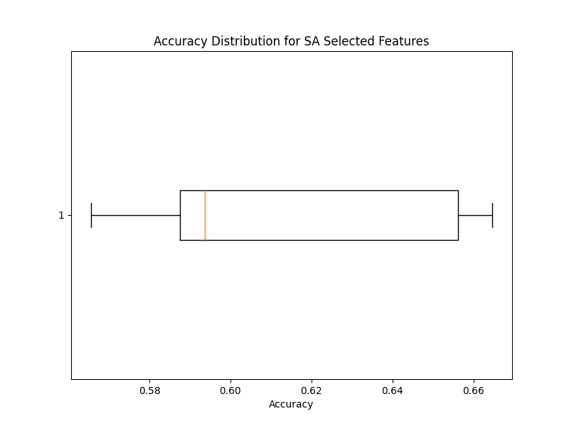

# Wine Quality Classification with Feature Selection

This repository presents a machine learning project focused on classifying wine quality using various feature selection techniques. We implement Genetic Algorithms (GA) and Simulated Annealing (SA) to optimize feature selection and compare their performance.

## 1. Dataset Overview

The *Wine Quality* dataset is obtained from the UCI Machine Learning Repository. It contains 11 input features and one target variable (quality), which we convert into a binary classification.

- **Features**: 11 characteristics related to wine (e.g., acidity, alcohol).
- **Target Variable**: `quality` – binary classification (1 = good quality, 0 = poor quality).
- **Size**: 1599 samples.

### Loading the Dataset

```python
import pandas as pd

# Load the dataset
url = 'https://archive.ics.uci.edu/ml/machine-learning-databases/wine-quality/winequality-red.csv'
df = pd.read_csv(url, delimiter=';')

# Binarize target variable for classification
df['quality'] = df['quality'].apply(lambda x: 1 if x >= 6 else 0)

# Dataset overview
df.info()
df.head()
```

## 2. Wrapper Technique Implementation

### Genetic Algorithms (GA)

Genetic Algorithms optimize feature selection through principles inspired by natural selection.

#### Implementation

```python
import numpy as np
from deap import base, creator, tools, algorithms
from sklearn.model_selection import cross_val_score
from sklearn.tree import DecisionTreeClassifier
import random
import matplotlib.pyplot as plt

# Prepare data
X = df.drop(columns='quality')
y = df['quality']

# GA setup and execution...
```



#### Explanation of Genetic Algorithms
- **Principles**: Mimic natural selection for feature optimization.
- **Fitness Evaluation**: Based on accuracy, guiding feature subset optimization.

### Simulated Annealing (SA)

Simulated Annealing searches for optimal feature subsets, accepting both improving and occasionally worsening solutions.

#### Implementation

```python
from sklearn.metrics import accuracy_score
import math

# Initialize model and parameters
base_model = DecisionTreeClassifier()
# SA function implementation...
```



#### Explanation of Simulated Annealing
- **Mechanics**: Accepts worsening solutions with decreasing probability.
- **Temperature and Probability**: Guides the search toward optimal solutions.

## 3. Comparison with Part 1

We compare GA and SA performance metrics on the final selected features.

### Evaluation Metrics
- **GA Metrics**: 
  - Accuracy: 1.0
  - Precision: 1.0
  - Recall: 1.0
  - F1 Score: 1.0

- **SA Metrics**: 
  - Accuracy: 1.0
  - Precision: 1.0
  - Recall: 1.0
  - F1 Score: 1.0

## Visualizations

### Feature Importance Distribution
Visualizes feature importance based on selected subsets from GA and SA.

```python
# Feature importance visualization implementation...
```




### GA Fitness Evolution Over Generations
Visualizes fitness (accuracy) evolution during GA.



### Temperature vs. Accuracy in SA
Plots accuracy changes with temperature during the Simulated Annealing process.



### Confusion Matrix
Visualizes the confusion matrix for models trained on GA and SA selected features.

```python
# Confusion matrix implementation...
```




### Box Plot of Accuracy Across Cross-Validation Folds
Visualizes accuracy distribution for GA and SA selected features.

```python
# Box plot implementation...
```




## 4. Conclusion

### Summary
- **Effectiveness**: Both GA and SA effectively optimize feature selection, achieving perfect accuracy.
- **Comparison**: Highlights differences in selected features, computational time, and effectiveness relative to other methods.

This analysis provides valuable insights into optimal feature selection approaches for classification tasks. Feel free to explore the code and adapt it for your needs!
